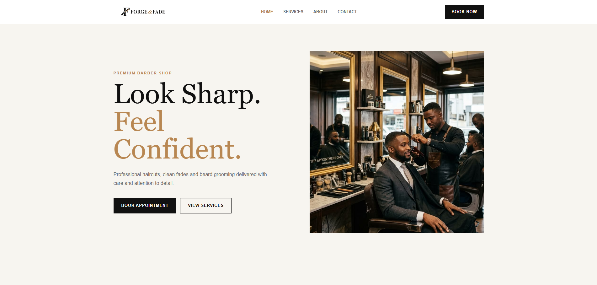

# Forge & Fade

Forge & Fade is a modern full-stack barbershop website built to make discovering services and booking an appointment simple. The experience combines a polished, responsive React interface with a Laravel API for live availability, appointment management, and customer enquiries.



## Features

- Browse haircut, fade, beard, and grooming services
- Meet the barbers and learn about the shop
- Check available appointment times before booking
- Book an appointment with a preferred barber
- Add confirmed appointments to Google or Apple Calendar
- Send customer enquiries through the contact form
- Prevent conflicting bookings through server-side validation

## Tech Stack

| Application | Technologies |
| --- | --- |
| Frontend | React 19, Vite, React Router, Axios, Sass, Lucide React |
| Backend | PHP 8.2+, Laravel 12, Laravel Sanctum |
| Database | MySQL, PostgreSQL, or SQLite through Laravel Eloquent |

## Project Structure

```text
Forge-And-Fade/
|-- frontend/   # React client and customer-facing pages
|-- backend/    # Laravel API, booking logic, and data models
`-- docs/       # Project screenshots and documentation assets
```

## Getting Started

Set up and run each application separately:

- [Frontend setup](frontend/README.md)
- [Backend setup](backend/README.md)

The frontend expects the API at `http://127.0.0.1:8000/api` by default. You can change it with the `VITE_API_URL` value in `frontend/.env`.

## Main API Routes

| Method | Endpoint | Purpose |
| --- | --- | --- |
| `GET` | `/api/bookings/availability` | Get unavailable appointment times |
| `POST` | `/api/bookings` | Create a booking |
| `POST` | `/api/contact` | Submit a contact message |

## License

This project is provided for portfolio and demonstration purposes.
